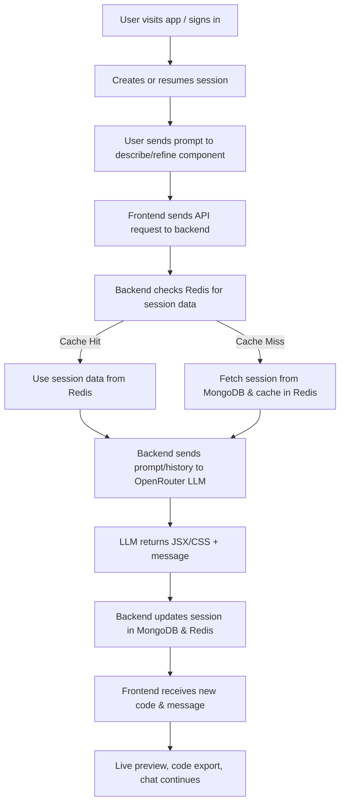

# DevForge | AI-Driven React Component Generator

A full-stack platform that lets you generate, preview, and iteratively refine React components using natural language prompts. Powered by OpenRouter LLM for AI, MongoDB for persistence, and Redis for blazing-fast session caching.

---

## ✨ Features
- **Modern Next.js + Tailwind CSS frontend**
- **Express.js backend with REST API**
- **Sign up, sign in, JWT authentication**
- **Session management (list, create, resume)**
- **Chat-driven component generation**
- **Live preview of AI-generated JSX/CSS**
- **Code export (copy/download)**
- **Session caching with Redis (Render cloud)**
- **MongoDB for persistent storage**

---

## 🔄 Workflow



---

## ⚙️ Setup & Installation

### 1. Backend (server)
- Go to `server/`
- Install dependencies:
  ```sh
  npm install
  ```
- Create `.env` with:
  ```env
  MONGODB_URI=your-mongodb-uri
  JWT_SECRET=your-secret
  OPENROUTER_API_KEY=your-openrouter-key
  REDIS_URL=your-render-redis-url
  PORT=8080
  ```
- Start server:
  ```sh
  npm start
  # or
  node server.js
  ```

### 2. Frontend (client)
- Go to `client/`
- Install dependencies:
  ```sh
  npm install
  ```
- (Optional) Create `.env.local` for frontend env vars
- Start dev server:
  ```sh
  npm run dev
  ```
- Open [http://localhost:3000](http://localhost:3000)

---

## 🔗 Workflow
1. **User signs up/signs in** (JWT issued, stored in localStorage)
2. **User creates or resumes a session**
3. **User chats with AI** to describe or refine a React component
4. **Backend uses OpenRouter LLM** to generate JSX/CSS, caches session in Redis, persists to MongoDB
5. **Frontend displays live preview** and code export options
6. **Sessions are always available** thanks to DB + cache

---

## 🤖 LLM & AI
- Uses [OpenRouter API](https://openrouter.ai/) (compatible with GPT-4, Mixtral, etc.)
- Prompts and session history are sent to LLM for context-aware code generation

---

## ⚡ Redis Caching
- Session data is cached in Redis for 1 hour per session
- Greatly improves chat and session resume performance
- If Redis is unavailable, backend falls back to MongoDB

---

## 🔒 Security
- JWT-based authentication (tokens in localStorage)
- `.env`, `.env.local`, and all secrets are gitignored
- No sensitive data in code or repo

---

## 🚀 Deployment
- Backend: Render
- Frontend: Vercel


---

## 🙌 Credits & License
- Built by Dev Prasad Narayan Patra
- Powered by OpenRouter, MongoDB, Render Redis, Next.js, Express, Tailwind CSS
- MIT License


